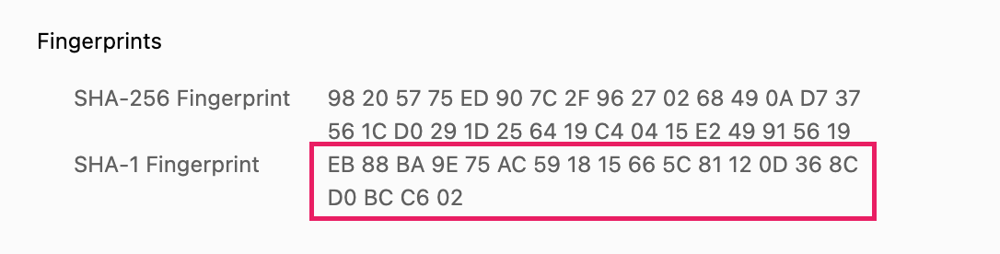

# ESP8266 WiFi Module

## Hardware requirements

- [ESP8266 WiFi Module](https://www.amazon.ca/dp/B00O34AGSU)
- Arduino Uno board (used as programmer)

## Setup development environment

1. Follow the instructions in the [esp8266/Arduino](https://github.com/esp8266/Arduino) repository to install the libraries using Arduino's Board Manager.
1. Select the serial port
1. Select **Generic ESP8266 Module** for the board

## Define variables

In [`wifi-module.ino`](wifi-module.ino), define the following values:

1. `SSID` and `PASSWORD` with the WiFi network name and password
1. `URL` with the URL where the data will be sent to
1. `FINGERPRINT` with the SSL certificate SHA-1 fingerprint of the URL where the data will be sent to
   - In Google Chrome, click on the lock icon in the URL bar
   - Select **Connection is secure**
   - Select **Certificate is valid**
   - In the popup that opens, copy the value of the **SHA-1 Fingerprint** field
     

## Upload code to ESP8266 module

1. Connect the ESP8266 module to the Arduino board:
   
1. Compile and upload the code
1. Once the IDE tries to connect to the module to upload, press the button to connect RST to GND for 1 second in order for the upload to proceed
